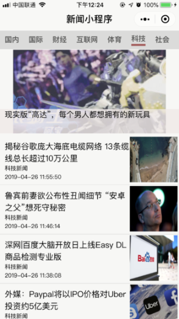

# 看个新闻小程序

## 介绍

利用微信小程序官方开发者工具开发，使用万维易源提供的免费新闻API获取新闻数据，生成新闻列表。

## 说明

- 分频道的新闻列表。

- 对爬虫内容进行处理，优化图片显示结果。

- 新闻列表到新闻详情页的跳转。


## 使用

克隆本项目代码到本地
```
git clone https://github.com/KyraYang/News-Miniprogramme.git 

cd News-Miniprogramme
```
打开微信开发者工具；
添加项目->选择本项目目录->编译执行；

## 预览

 
